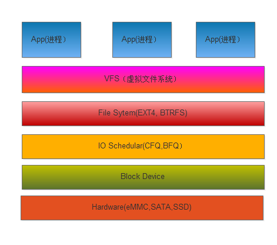
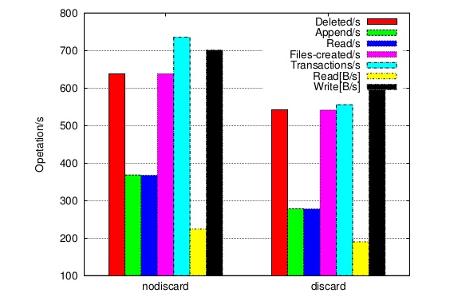

Android Filesystem Performance

===================================
### 文件存储架构图

### 存储技术

目前主流存储技术,嵌入式设备使用eMMC,UFS, 服务器和PC使用SATA, SSD.

* eMMC
目前主流手机都是使用eMMC存储器，目前最高的技术标准为eMMC5.1，接口HS400,理论最大带宽可达到832Mb/s，最大存储容量512G．
* UFS
2016年以后主流旗舰手机使用UFS存储器，支持的技术标准为UFS2.1,最大传输速度可达到1166Mb/s.与eMMC对比，速度更高，功耗低．
* SATA
服务器和个人电脑使用SATA接口的硬盘，容量大，存储容量T级别,SATA3.2最大传输速度16G/s.如OBOX产品采用混合存储eMMC为系统存储，SATA为用户存储空间．
* SSD
固态硬盘，个人笔记本市场采用.

速度比较

Standard| Sequential Speed Read |  Sequential Write Read | Ramdon Read | Ramdon Write
--------|----------|-------------|------------------------|------------|------------
UFS2.0  | 350Mb/s| 150Mb/s| 19000 IO/s| 14000 IO/s
eMMC5.1 | 250Mb/s| 125Mb/s| 11000 IO/s| 13000 IO/s

Radom R/W非连续，一次读写小于4K.

$$IOPS*TransferSizeInBytes=BytesPerSec$$

特殊情况，尽量避免小文件的频繁读写．

如性能需提升，需主控端支持UFS,EMMC标准接口，存储器选用读写速度最好的．

### eMMC控制
* 提升eMMC主控端的时钟频率
* 开启DMA支持
* 支持Trim控制命,Flash特性不支持覆盖，先擦写后写入.Trim指令flash页无效，进行内部擦写动作，释放有效页空间．

文件读写的速度与eMMC spec匹配．

### 文件系统
Android系统System和user data分区使用ext4文件系统格式，目前ext4是主流Linux和Android文件系统,部分厂商开始开发使用f2fs文件系统，如华为，三星
支持Trim,文件下系统需要支持discard属性,Android 4.3系统已经开始支持．

目前主流文件系统有ext4,F2FS,Btrfs,xfs，性能比较通过不同大小block进行Sequential读写，Ramdon读写，数据库操作等来衡量．内核的版本也会对不同的文件系统有优化，各个文件系统侧重点不同，目前能够支持Android系统有ext4,F2FS．

从目前公开测试的结果，F2FS随机读写优于ext4,不过内核版本Linux 4.14以后，ext4,F2FS性能差距变小．

公开的测试benchmarks
* [Linux 4.14 File-System Benchmarks: Btrfs, EXT4, F2FS, XFS](https://www.phoronix.com/scan.php?page=article&item=linux414-fs-compare&num=2)

### I/O调度
I/O调度器是将请求设备块的IO读写操作按照它们对应在块设备上的扇区号进行排列，进行存储操作。
目前I/O调度算法使用CFQ,BFQ．主流Android手机默认是CFQ（Completely Fair Queuing），平衡性很好，性能差。BFQ是kernle 4.12.0加入的调度算法，应用交互延迟短，调度算法优于CFQ,最新的高通平台都使用了BFQ．
