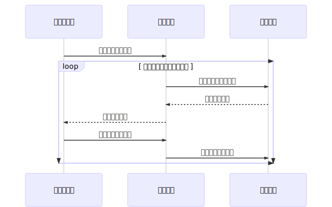

蓝牙考勤

========================================
####背景####
考勤服务器发送考勤名单给蓝牙基站，蓝牙基站扫描周围环境的蓝牙手环，通过手环的指纹信息确认打卡．
蓝牙基站与考勤服务器通过以太网连接，蓝牙基站由一个以太网转串口和蓝牙模块组成．

####工作流程####

###考勤服务器###
考勤服务器器需要提前录入蓝牙手环ID和指纹的匹配关系．考勤服务器通过网络与蓝牙基站间接连接．每个蓝牙基站对应一个固定IP地址，通过身份认证与考勤服务器建立网络连接(TCP/UDP，或http)．消息定义建议用json格式．

如请求消息:
{
	"type": 1
	"sign":[id1,id2,id3,id4]
}
回应消息
{	
	"type":2
	"btaddr":xxxx
	"idcard":xxxxxxxxxxxxxxxxxxxxx //指纹信息
}
应答消息
{
	"btaddr":xxxx
	"status":OK/NO	
}
###蓝牙基站###
蓝牙基站负责考勤名单获取，扫描蓝牙手环，指纹上传，消息中转．
软件设计要点
* 避免连接单个蓝牙手环时间过长，增加单个连接时间处理，每个蓝牙连接获取指纹不能超过30s,如超过进行下一个进行扫描认证．
* 扫描认证增加时间限制，如从下发考勤名单，到考勤结束，如规定必须在10分钟之内完整个认证流程．
* 在规定的时间之内，未认证的蓝牙名单能够进行循环扫描
* 支持手环多次认证如失败能重复采集上传，在规定的时间内认证成功为止．

蓝牙基站与蓝牙手换消息定义
* 请求消息 大小byte
0001000 请求认证
0010001 认证成功
0010010 认证失败
* 指纹应答消息
idcard:xxxxxxxxxxxxxxxxxx//指纹信息

###蓝牙手环###
来自考勤记录请求，显示指纹采集请求．指纹采集成功，需反馈结果，认证成功或失败．
蓝牙手环状态
* 连接蓝牙基站
* 考勤记录请求
* 指纹采集
* 上传指纹
* 认证结果

###技术要点###
以太网转UART，uart数据格式支持文本，找到HTTP协议最好
蓝牙连接手环，单个连接认证消耗时间，支持蓝牙匹配免密码．