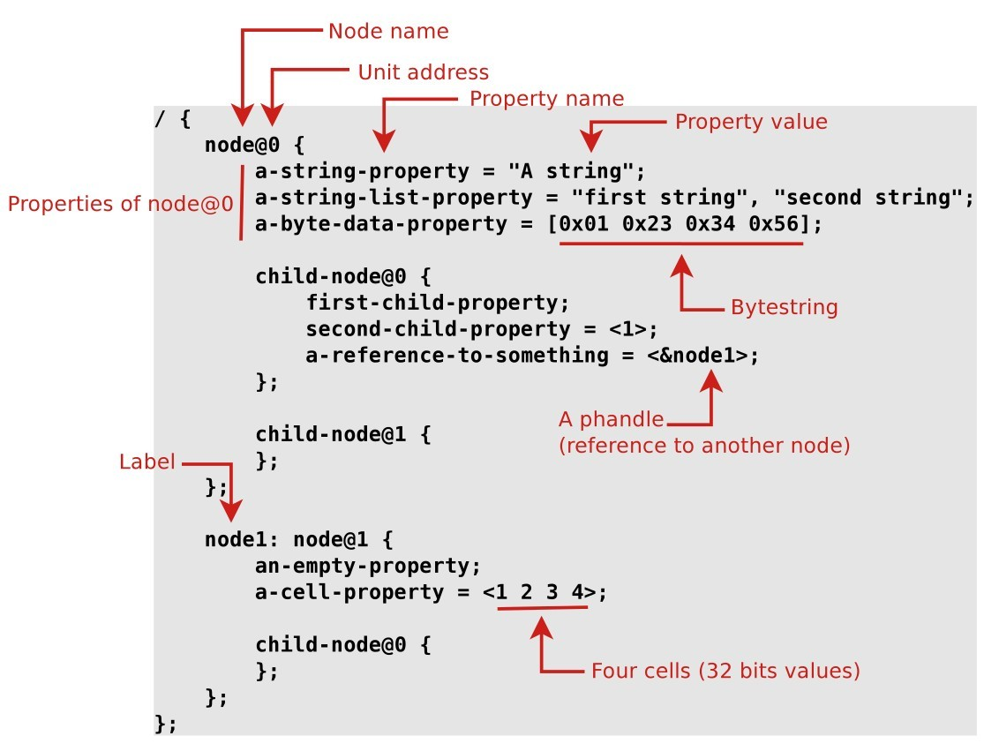

###进程
进程描述符，current为当前进程描述符宏中的task_struct．

~~~cpp
#define current get_current()
//arch/arm64/include/asm/current.h
~~~
进程时间片：分配可运行程序的处理器时间段，默认时间片的10ms

* 进程状态
TASK_RUNNING  可执行状态 和 正在执行的状态
TASK_INTERRUPTIBLE 等待状态。等待状态可被信号解除
TASK_UNINTERRUPTIBLE 等待状态,状态不可中断。等待状态不可被信号解除

###线程

线程自己的栈和寄存器

###内核线程
~~~cpp
struct task_struct*kthread_create(int(threadFn*)(void*data),void*data,const char*namefmt[],...);
kthread_run
创建内核线程，不主动运行，运行需要wake_up_process()唤醒.
~~~
~~~cpp
struct task_struct*kthread_run(int(threadFn*)(void*data),void*data,const char*namefmt[],...);
kthread_run
创建内核线程，运行，通过kthread_create,wake_up_process实现.
~~~

~~~cpp
int kthread_stop(struct task_struct *k);
结束kthread,过程
1.Sets kthread­>kthread_should_stop to true
2.唤醒线程
3.等待线程结束
~~~
~~~cpp
bool kthread_should_stop(void);
~~~

###内核抢占
当进程位于内核空间时，有一个更高优先级的任务出现时，如果当前内核允许抢占，则可以将当前任务挂起，执行优先级更高的进程。
$$
preempt\_count \gt  0  　　\text{　禁止内核抢占　}
$$
~~~cpp
preempt_disable() // preempt_count + 1
get_cpu() //preempt_disable()一样
preempt_enable() // preempt_count - 1
put_cpu() //preempt_enable()一样
preempt_enable_no_resched() // preempt_count -1，不立即抢占式调度 
put_cpu＿no_resched()　//preempt_enable_no_resched一样
~~~

抢占的时机：
1.中断返回内核之前
2.在锁释放的时候

###softIRQ
内核提供的一种延迟执行机制,tasklet，高分辨率timer.
###自旋锁
SMP多处理器中并发访问临界区，防止内核抢占造成的竞争。
用途高效的对互斥资源进行保护，同步临界区时间不能过长，处理过程中CPU不能处于休眠状态．

###工作队列
工作推后执行的形式.工作队列可以把工作推后，交由一个内核线程去执行.运行在进程上下文中执行
~~~ cpp
struct workqueue_struct *create_workqueue(const char *name);
## 内核会在系统中的每个处理器上为该工作队列创建专用的线程
struct workqueue_struct * workqueue_singlethread_workqueue(const char *name);
## 创建一个专用的线程
~~~
###Tasklet

###页高速缓存
页高速缓存是内核实现的缓存技术，把数据缓存到物理内存，减少对存储的IO操作。理论上，如有足够大的内存，分配的页高速缓存足够大，读速度可以接近内存的速度．
缓冲区相关配置
/proc/sys/vm/dirty_ratio　缓冲区的大小，表示系统内存的百分比,Android默认值5%．
/proc/sys/vm/drop_caches　控制清理缓存
/proc/pagetypeinfo
/proc/buddyinfo
buddy算法解决物理内存的外碎片问题，其把所有空闲的内存，以2的幂次方的形式，分成11个块链表，分别对应为1、2、4、8、16、32、64、128、256、512、1024个页块。
/proc/meminfo
/proc/slabinfo
slab机制减少这种内部碎片，申请几十个字节
/proc/vmallocinfo

非重要文件的读写后，及时清除，避免产生缓存垃圾．

###内核空间内存申请
~~~cpp
void *kmalloc(size_t size, gfp_t flags)
kmalloc(),分配物理内存映射区域，而且在物理上也是连续的,分配的内存大小有限制（128KB）
flags:
GFP_ATOMIC —— 分配内存的过程是一个原子过程，分配内存的过程不会被（高优先级进程或中断）打断；
GFP_KERNEL —— 正常分配内存；
GFP_DMA —— 给 DMA 控制器分配内存，需要使用该标志（DMA要求分配虚拟地址和物理地址连续）。
~~~
*  kzalloc() kmalloc(__GFP_ZERO)

~~~cpp
void kfree(const void *objp);
释放kmalloc，kzalloc分配的内存,可以睡眠，因此不能从中断上下文调用。 
~~~

~~~cpp
void *devm_kmalloc(struct device *dev, size_t size, gfp_t gfp); 
void *devm_kzalloc(struct device *dev, size_t size, gfp_t gfp);  
kmalloc,kzalloc分配内存和设备进行关联
~~~

~~~cpp
void devm_kfree(const void *objp);
devm_kmalloc，devm_kzalloc分配的内存,可以睡眠，因此不能从中断上下文调用。 
~~~

~~~cpp
void *vmalloc(unsigned long size);
虚拟内存空间给出一块连续的内存区，但这片连续的虚拟内存在物理内存中并不一定连续
~~~
~~~cpp
void vfree(const void *addr);
释放vmalloc分配的内存,可以睡眠，因此不能从中断上下文调用。 
~~~

使用场景
kmalloc 分配内存的开销小，因此 kmalloc 比 vmalloc 要快
一般情况下，内存只有在要被 DMA 访问的时候才需要物理上连续，但为了性能上的考虑，内核中一般使用 kmalloc()，而只有在需要获得大块内存时才使用 vmalloc()。例如，当模块被动态加载到内核当中时，就把模块装载到由 vmalloc() 分配的内存上。

###内核调度
~~~cpp
schedule() 显示调用运行调度
sched_yield() 
yield()主动放弃CPU运行时间
~~~
CFS(完全公平调度算法） SCHED_NOMAL
实时调度算法 SCHED_FIFO和SCHED_RR
通过nice和counter值决定权值，nice越小，counter越大，被调度的概率越大，调度策略、优先级，获取CPU时间片大小
nice 范围　[-20,19]

SCHED_FIFO一旦占用cpu则一直运行。一直运行直到有更高优先级任务到达或自己放弃
SHCED_RR策略的进程的时间片用完，系统将重新分配时间片，并置于就绪队列尾。放在队列尾保证了所有具有相同优先级的RR任务的调度公平。
实时进程为静态优先级 [0,MAX_RT_PRIO]

TOP查看
PR=NI+20

Linux实际上实现了140个优先级范围，取值范围是从0-139，这个值越小，优先级越高。nice值的-20到19，映射到实际的优先级范围是100-139。实时进程优先级为[0-99]

###SATA
SATA硬盘的write-through ,write-back
###中断
~~~cpp
int request_threaded_irq(unsigned int irq, irq_handler_t handler, irq_handler_t thread_fn,
                         unsigned long irqflags, const char *devname, void *dev_id)
~~~
查看中断注册信息 `/proc/interrupts`
~~~shell
cat /proc/interrupts
~~~
~~~cpp
void synchronize_irq(unsigned int irq);
~~~
###系统调用
###Device Tree
####语法
[label:] node-name[@unit-address] { 
   [properties definitions] 
   [child nodes] 
}

[]为option选项，用于引用&

如图：

如
~~~shell
	dsi_dual_nt35597_truly_video_display: qcom,dsi-display@0 {
		compatible = "qcom,dsi-display";
		label = "dsi_dual_nt35597_truly_video_display";
		qcom,display-type = "primary";

		qcom,dsi-ctrl = <&mdss_dsi0 &mdss_dsi1>;
		qcom,dsi-phy = <&mdss_dsi_phy0 &mdss_dsi_phy1>;
		clocks = <&mdss_dsi0_pll BYTECLK_MUX_0_CLK>,
			<&mdss_dsi0_pll PCLK_MUX_0_CLK>;
		clock-names = "src_byte_clk", "src_pixel_clk";

		pinctrl-names = "panel_active", "panel_suspend";
		pinctrl-0 = <&sde_dsi_active &sde_te_active>;
		pinctrl-1 = <&sde_dsi_suspend &sde_te_suspend>;
		qcom,platform-reset-gpio = <&tlmm 75 0>;
		qcom,panel-mode-gpio = <&tlmm 76 0>;

		qcom,dsi-panel = <&dsi_dual_nt35597_truly_video>;
		vddio-supply = <&pm660_l11>;
		lab-supply = <&lcdb_ldo_vreg>;
		ibb-supply = <&lcdb_ncp_vreg>;
	};
	
   &dsi_dual_nt35597_truly_video_display {
	qcom,dsi-display-active;
   };
~~~
~~~cpp

const void *of_get_property(const struct device_node *node,
				const char *name,
				int *lenp);
				

display->name = of_get_property(pdev->dev.of_node, "label", NULL);
//获取dsi_dual_nt35597_truly_video_display
	
~~~
~~~cpp
struct device_node *of_parse_phandle(const struct device_node *np,
					    const char *phandle_name,
					    int index);
//获取引用节点　qcom,dsi-ctrl
struct device_node＊of_node = of_parse_phandle(display->pdev->dev.of_node,
					   "qcom,dsi-ctrl", ０);
~~~

~~~cpp
int of_get_named_gpio(struct device_node *np,
                                   const char *propname, int index);
~~~

~~~cpp
const struct of_device_id *of_match_node(
	const struct of_device_id *matches, const struct device_node *node);
struct device_node *of_get_child_by_name(const struct device_node *node,
				const char *name);//获取子节点device_node
~~~
####REG
~~~
#address-cells = <1>;
#size-cells = <0>;
reg = <address1 length1 [address2 length2] [address3 length3] ... >
~~~
~~~
	mdss_dsi0: qcom,mdss_dsi_ctrl0@ae94000 {
		compatible = "qcom,dsi-ctrl-hw-v2.2";
		label = "dsi-ctrl-0";
		cell-index = <0>;
		reg =   <0xae94000 0x400>,
			<0xaf08000 0x4>;
		reg-names = "dsi_ctrl", "disp_cc_base";
~~~
~~~cpp
struct resource * res = platform_get_resource_byname(pdev, IORESOURCE_MEM, "dsi_ctrl");
//获取IO内存资源节点指针， 包括了地址的开始，结束地址等, 该IO内存的长度可用 resource_size（） 来获取
resource_size_t resource_size(const struct resource *res)
{
	return res->end - res->start + 1;
}

//驱动程序并不能直接通过物理地址访问I/O内存资源，而必须将它们映射到核心虚地址空间内（通过页表），然后才能根据映射所得到的核心虚地址范围，通过访内指令访问这些I/O内存资源。内核中的使用，往往是为某个设备预留一块内存，当使用的时候需要在board中定义这个设备的内存resource。通过 platform_get_resource获得设备的起始地址后，可以对其进行request_mem_region和ioremap等操作，以便应用程序对其进行操作。

~~~

###Platform设备驱动
~~~cpp
数据结构

struct platform_device {
const char * name; //设备名称
int id;
struct device dev;　//设备信息
u32 num_resources; //设备使用各类资源的数量
struct resource * resource; //设备使用的资源

struct platform_device_id *id_entry;
};
~~~
~~~cpp
struct resource {
	resource_size_t start;
	resource_size_t end;
	const char *name;
	unsigned long flags;
	unsigned long desc;
	struct resource *parent, *sibling, *child;
};
~~~

~~~cpp
void platform_set_drvdata(struct platform_device *pdev,
					void *data);
void *platform_get_drvdata(const struct platform_device *pdev);
~~~
###Clock

**Clock Crystal**
**PLL**

###Component
###ioremap
ioremap将一个IO地址空间映射到内核的虚拟地址空间上去，便于访问。

~~~cpp
void __iomem *devm_ioremap(struct device *dev, resource_size_t offset,
			   resource_size_t size);
void __iomem *devm_ioremap_nocache(struct device *dev, resource_size_t offset,
				   resource_size_t size);
~~~
###Regulator
Regulator模块用于控制系统中某些设备的电压/电流供应。supply regulator和consumer regulator
###Completion
completion是一种轻量级的机制，它允许一个线程告诉另一个线程工作已经完成。
~~~cpp
struct completion {  
    unsigned int done;/*用于同步的原子量*/  
    wait_queue_head_t wait;/*等待事件队列*/  
};

void init_completion(struct completion *x);

~~~
###等待队列
###ELF
代码段
数据段
未初始化数据段BSS
堆HEAP
栈STACK
###C++
重载
统一作用域内，函数相同，函数参数列表不同．
多态
一个接口，多种实现方法
静态多态和动态多态，

###volatile
volatile 修饰，则会从内存重新装载内容，而不是直接从寄存器拷贝内容
1.中断程序
2.多线程
###自旋锁
~~~cpp
spin_lock
~~~
###原子操作
原子操作是不可分割，不可中断的。
###BUILD WARNING
**ISO C90 forbids mixed declarations and code**
变量定义之前任何一条非变量定义的语句(注意：语句是会带分号的)都会引起这个警告！
###Sysrq
Linux内核的调试工具
~~~
#echo m > /proc/sysrq-trigger 导出内存分配信息

#echo t > /proc/sysrq-trigger 导出当前任务状态信息

#echo p > /proc/sysrq-trigger 导出当前CPU寄存器和标志位信息

#echo c > /proc/sysrq-trigger 产生空指针panic事件，人为导致系统崩溃

#echo s > /proc/sysrq-trigger 即时同步所有挂载的文件系统

#echo u > /proc/sysrq-trigger 即时重新挂载所有的文件系统为只读

#echo w > /proc/sysrq-trigger转储处于uninterruptable阻塞状态的任务
~~~
###SYSFS

~~~cpp
class_create（THIS_MODULE,name) //创建/sys/class/<name>　目录
class_create_file /创建/sys/class/<name>/创建文件
~~~
###SP,PC,LR

ARM指令是三级流水线，取指，译指,执行

ARM有如下几种工作模式：用户模式，FIQ模式，IRQ模式，系统模式，终止模式，数据访问终止模式，未定义模式。

PC程序计数器，PC指向的是正在取指的地址，那么cpu正在译指的指令地址是PC-4（假设在ARM状态 下，一个指令占4个字节），cpu正在执行的指令地址是PC-8，也就是说PC所指向的地址和现在所执行的指令地址相差8。 

LR链接寄存器，通常用来保存函数的返回地址。
###Runtime PM

###PM

