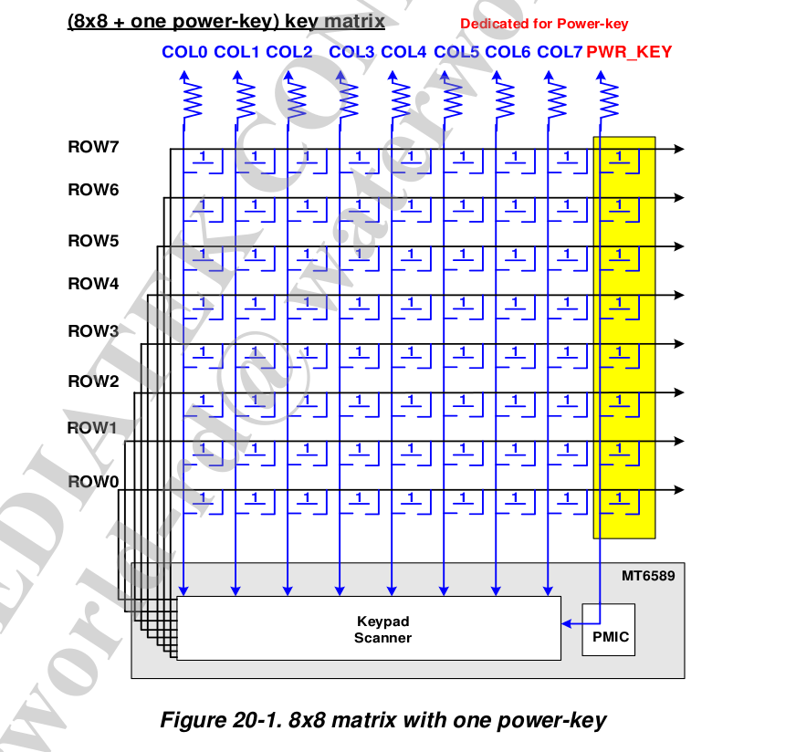
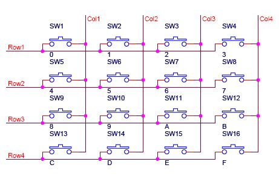
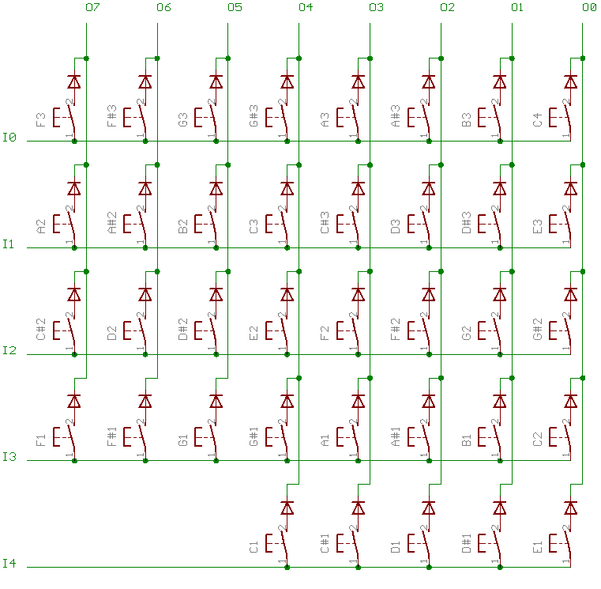

 键盘矩阵实现原理 

========================================
###原理
目前键盘设计中，采用中断方式，一个按键占用一个GPIO，如果需要的按键足够多时，主控端需要的GPIO不够用．这时候需要使用GPIO矩阵的方式.通过一组GPIO做为行(row)，列(col)组合来实现键盘矩阵的功能．其中一组GPIO作为输入端，另外一组GPIO作为输出端．

矩阵按键设计要求满足N-Key Rollover，N-Key Rollover（NKRO）代表能同时任意压下N颗按键，并正确输出，不会发生键位冲突。

**MTK按键矩阵设计**

当有按键被释放或按下，主控的KEYPAD IRQ中断产生，读取KP_MEM register 状态,侦测行和列的状态变化．目前有缺陷，不支持2个按键以上的组合按下，2个按键被按下，就会送出2个行与2个列状态到键盘控制器。2行与2列共可形成4颗键，所以光靠行列状态无法推算是4颗键中的哪3颗，而这时意外被导通电路的第4颗键，称为Phantom Key（幽灵键）或Ghost Key（鬼键）。

**二极管按键矩阵**
为了防止Ghost Key（鬼键）在每个按键位置的地方，都加1颗二极管（Diode）隔离电流倒灌，就不会使电路被意外导通而出错。
二极管按键矩阵电路图

工作原理:

1.按键设置在行、列线交点.
2.行线为输入端，列线是输出线,默认输出端为高电平
3.检测输入端电平变化（中断或轮循方式），延迟一段时间开始进行扫描
4.开始扫描按键位置，采用逐行扫描方式，每间隔扫描的时间，每一列做一下拉低电平，拉高电平动作，读取每行的输入端电平电平状态.每一列做一下拉低电平，拉高电平动作值动作做一次确认电路连通状态
５.对应所在行和列的电平状态值发生变更，说明有按键按下或释放动作

###算法
**数据结构**
ROW_NUM　行数
COL_NUM	 列数
row_gpios　行对应的gpio
col_gpios　列对应的gpio
(row,col,key) 按键映射表
其它参数
debounce　抖动时间
scan	扫描间隔

按键值

按键值 |row |col |code
----|-----|----------
int(32)|23~31| 15~22 | 0~15

按键状态
列状态 |row31 |row30 |...|row2|row1|row0
----|-----|---------|---|----|----|----
int(32)|1bit| 1bit |...|1bit|1bit|1bit

**流程**
1.行线为输入端，列线是输出端，默认输出端为高电平
2.每行输入端注册为中断，或轮循处理
3.中断发生，延迟抖动时间进入中断处理，或轮循处理.
4.拉低所有行的电平为低
5.开始扫描按键位置，拉高每一列电平，逐行读取行的电压状态值，完成后拉低列电平．注意在扫描的过程中，确保当前行为高电平，其他行为低电平，防止电流干扰
6.比较按键状态状态变化，进行对应按键值的动作上报，保存按键状态，进行下一次扫描动作
7.恢复所有行输出端为高电平

2~7是个loop动作

~~~cpp
按键映射值，高16位为行，列，低16位为键值码
#define KEY(row, col, val)	((((row) & (MATRIX_MAX_ROWS - 1)) << 24) |\
				 (((col) & (MATRIX_MAX_COLS - 1)) << 16) |\
				 ((val) & 0xffff))

#define KEY_ROW(k)		(((k) >> 24) & 0xff)
#define KEY_COL(k)		(((k) >> 16) & 0xff)
#define KEY_VAL(k)		((k) & 0xffff)

按键映射表
static const uint32_t keys[] = {
 KEY(0, 0, KEY_HOME),
 KEY(0, 1, KEY_BACK),
 KEY(0, 2, KEY_MENU),
 KEY(0, 3, KEY_UP),
 KEY(1, 0, KEY_DOWN),
 KEY(1, 1, KEY_LEFT),
 KEY(1, 2, KEY_RIGHT),
};

uint32_t last_key_state[MATRIX_MAX_COLS];//每列对应的按键状态，bit位对应每列的状态

static bool matrix_keypad_map_key(const uint32_t *keys, int keymap_size, unsigned int row, unsigned int col,unsigned int*key)
{
	int i;
	for(i = 0; i< keymap_size; i++){
		if( KEY_ROW(keys[i]) == row && KEY_COL(key[i]) == col ){
			*key = KEY_VAL(key[i]);
			return true;
		}
	}
	return false;
}

//中断处理，或轮循处理
static void matrix_keypad_scan(){
	unsigned int row, col, code;
	uint32_t new_state[MATRIX_MAX_COLS];
	uint32_t bits_changed;
	
	activate_all_cols(false);
	
	for(col=0 ; col < num_cols ; col++)
	{
		activate_all_col(col,true);
		for(row = 0 ; row < num_rows; row++)
		{
			new_state[col] |= row_asserted(row) ? (1 << row):0;//获取行的状态
		}
		activate_all_col(col,false);
	}
	
	for(col=0 ; col < num_cols ; col++)
	{
		for(row = 0 ; row < num_rows; row++)
		{
			bits_changed = last_key_state[col] ^ new_state[col];
			if( bits_changed == 0)
				continue;
			if(bits_changed &( 1 << row) == 0 )
			{
				continue;
			}
			if ( matrix_keypad_map_key(keys,keys_size,row,col,&code)){
				input_report_key(code, new_state[col] & ( 1 << row));
			}
		}
	}
	memcpy(last_key_state,new_state,sizeof(new_state));
	activate_all_cols(true);
}

~~~