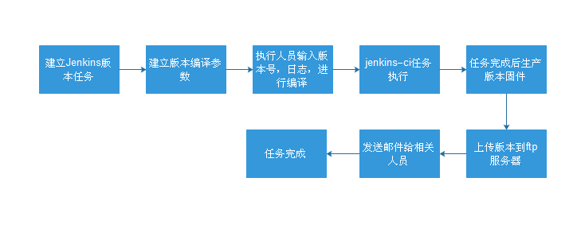

 笔记 

========================================

###桌面快捷方式
\${HOME}.local/share/applications为快捷方式配置目录,进入${HOME}.local/share/applications目录，创建相关应用desktop文件，如eclipse.desktop．
~~~shell
[Desktop Entry]
Name=Eclipse
Type=Application
Exec=${HOME}/eclipse/jee-neon2/eclipse/eclipse ://${HOME} 用户工作目录
Terminal=false
Icon=/home/redbird/eclipse/jee-neon2/eclipse/icon.xpm
Comment=Integrated Development Environment
NoDisplay=false
Categories=Development;IDE;
Name[en]=Eclipse
~~~~

###Eclipse导入maven的项目
Eclipse 菜单FILE -> Import -> Maven -> Existing Maven Projects
###Ping出现DUP!
ping应答出现了重复的包duplicate
###Ubuntu WiFi热点
修改配置文件
~~~
/etc/NetworkManager/system-connections/
mode=ap(mode改为ap)
~~~
###正则表达式

####贪婪与非贪婪
贪婪匹配:趋向于最大长度匹配.
非贪婪匹配：匹配到结果就好，就少的匹配字符。

####分组(捕获组capture group)
捕获组就是把正则表达式中子表达式匹配的内容，保存到内存中以数字编号或显式命名的组里，方便后面引用。
####无名分组
分组就是用一对圆括号“()”括起来的正则表达式，匹配出的内容就表示一个分组。从正则表达式的左边开始看，看到的第一个左括号“(”表示第一个分组，第二个表示第二个分组，依次类推，需要注意的是，有一个隐含的全局分组（就是0），就是整个正则表达式。 
分完组以后，要想获得某个分组的内容，直接使用group(num)和groups()函数去直接提取就行。
####命名分组
命名分组就是给具有默认分组编号的组另外再给一个别名。命名分组的语法格式如下：
~~~
(?P<name>正则表达式)#name是一个合法的标识符
~~~
####非捕捉组
(?:)参与匹配却不进行分组编号．
(?=)
(?<=)

####正则表达式在线工具

* [可视化显示](https://regexper.com)

* [在线测试](https://regexr.com)

* JAVA正则匹配
JAVA使用Pattern，Matcher
~~~java
import java.util.regex.Pattern;
import java.util.regex.Matcher;
~~~
如字符串
~~~shell
Node    0, zone    DMA32, type      Movable   1862   1665   1697    885    344     99     42     15      4      3      2
~~~
~~~java
regex = "^Node\\s+(\\d+),.*. type\\s+(\\w+)\\s+([\s\d]+?)\s*$";
~~~

###正则表达式用例
~~~bash
有字符串,如下
<project path="external/mksh" name="platform/external/mksh" groups="pdk" />
提取path=""内容
 sed 's/.*<.*path="\(.*\)".*name.*>.*/\1/g'
 
~~~

###EXT4加密属性
强制加密forceencrypt=footer，无法修改或删除文件
encryptable=footer
###信号
* SIGSEGV
内存错误，数值越接

###CPU占用率
/proc/stat

user nice system idle iowait  irq  softirq steal guest guest_nice

### SHELL bash
控制语句while
~~~bash
#!/bin/bash
a=0
while [ $a -lt 10 ]
do
   echo $a
   a=`expr $a + 1`
   uuid=$(blkid /dev/sdb$a)
   echo ${uuid}
done
~~~
循环控制for

###数据库
####postgresl
切换到数据库
~~~shell
$ su - postgres 
$ psql
$ \l "列出数据库"
$ DROP DATABASE数据库名; //删除数据库
$ \q
$ pg_dump reviewdb > reviewdb_20161222 "备份数据库"
$ psql dbname < backup_file "恢复数据库"
~~~
###JAVA SSL
在ubuntu14.04运行jenkins发现错误　
~~~java
java.security.InvalidAlgorithmParameterException: the trustAnchors parameter must be
    non-empty
~~~
解决方法
~~~shell
$ update-ca-certificates -f 
$ /var/lib/dpkg/info/ca-certificates-java.postinst configure 
~~~
### Jenkins
系统配置，安装插件
* Email Extension Template Plugin
* FTP publisher plugin
* Gerrit Trigger
* Publish Over FTP
* Publish Over SSH

版本自动构建过程

###protobuf
Nanopb C语言实现Google protobuf 协议库. 

Protobuf消息定义
消息由至少一个字段组合而成，类似于C语言中的结构。每个字段都有一定的格式。
字段格式：限定修饰符 | 数据类型 | 字段名称 | = | 字段编码值 | [字段默认值]
* 限定修饰符包含
Required: 表示是一个必须字段，必须相对于发送方，在发送消息之前必须设置该字段的值，对于接收方，必须能够识别该字段的意思。发送之前没有设置required字段或者无法识别required字段都会引发编解码异常，导致消息被丢弃。
Optional：表示是一个可选字段，可选对于发送方，在发送消息时，可以有选择性的设置或者不设置该字段的值。对于接收方，如果能够识别可选字段就进行相应的处理，如果无法识别，则忽略该字段，消息中的其它字段正常处理。---因为optional字段的特性，很多接口在升级版本中都把后来添加的字段都统一的设置为optional字段，这样老的版本无需升级程序也可以正常的与新的软件进行通信，只不过新的字段无法识别而已，因为并不是每个节点都需要新的功能，因此可以做到按需升级和平滑过渡。
Repeated：表示该字段可以包含0~N个元素。其特性和optional一样，但是每一次可以包含多个值。可以看作是在传递一个数组的值。
* 数据类型
 
Protobuf定义了一套基本数据类型。几乎都可以映射到C++\Java等语言的基础数据类型.
protobuf 数据类型 |描述 |打包 |C++语言映射 
----|-----|----------
bool|布尔类型| 1字节  | bool
double | 64位浮点数 | N | double
float | 32为浮点数 |N |float
int32 |32位整数 |N |int
uin32 |无符号32位整数 |N |unsigned int
int64 |64位整数 |N |__int64
uint64 |64为无符号整 |N |unsigned __int64
sint32 |32位整数，处理负数效率更高 | N |int32
sing64 |64位整数 处理负数效率更高 |N |__int64
fixed32 |32位无符号整数 |4 |unsigned int32
fixed64 |64位无符号整数 |8 |unsigned __int64
sfixed32 |32位整数、能以更高的效率处理负数 |4 |unsigned int32
sfixed64 |64为整数 |8 |unsigned __int64
string |只能处理 ASCII字符 |N |std::string
bytes |用于处理多字节的语言字符、如中文 |N |std::string
enum |可以包含一个用户自定义的枚举类型uint32 |N(uint32) |enum
message |可以包含一个用户自定义的消息类型 |N |object of class
* 字段名称
字段名称的命名与C、C++、Java等语言的变量命名方式几乎是相同的。
* enum

枚举的定义和C++相同，枚举值必须大于等于0的整数。使用分号(;)分隔枚举变量而不是C++语言中的逗号(,)

###apt-get
apt-get安装的时候出现
E: 有未能满足的依赖关系。请尝试不指明软件包的名字来运行“apt-get -f install”(也可以指定一个解决办法)
运行如下命令解决
~~~shell
$:sudo apt-get --fix-broken install
~~~
查找包的依赖关系

~~~shell
$: apt-cache depends  package_name
~~~

配置文件丢失，强行安装，如apache安装后，不小心把/etc/apache/里面的文件删除。
-o DPkg::Options::="--force-confmiss" 进行重现按照恢复
~~~shell
$:apt-get -o DPkg::Options::="--force-confmiss" --reinstall install 
~~~
apt-get source packagename
出现如下错误
gpgv: Can't check signature: public key not found
dpkg-source: warning: failed to verify signature on
解决办法
~~~shell
$: gpg --keyserver keyserver.ubuntu.com --recv-keys A744BE93
$: gpg --no-default-keyring -a --export 7ADF9466 | gpg --no-default-keyring --keyring ~/.gnupg/trustedkeys.gpg --import -
~~~

###APT查看文件依赖包
~~~shell
$ apt-get install apt-file
$ apt-file update
$ apt-file search 文件
~~~

###IP CONNTRACK
/proc/net/ip_conntrack
查看不同连接跟踪带有MARK值。

###GIT
git使用openssl
~~~
make configure
./configure with-openssl 
~~~
git clone --depth 
打标签
~~~
git tag -a SPF.R1.0-00005.0 -m "SPF.R1.0-00005.0"
git push msp SPF.R1.0-00008.0 #推送tag
git push origin --delete tag <tagname> #删除远程分支
~~~

###Core DUMP
解除生产core dump文件限制
~~~
ulimit -c unlimited
~~~
###P2P
节点发现发现种子节点
###VIM
删除文件特定字符串
~~~shell
:%s/regex//g
~~~
###sshpass
用于自动化脚本时，非交互式的登录过程，sshpass　-p password
~~~shell
# 免密码登录
$ sshpass -p password ssh username@host
~~~
###IO多路复用
select/poll/epoll

select支持文件数量比较小，默认是1024

epoll_create,epoll_ctl和epoll_wait，epoll_create是创建一个epoll句 柄；epoll_ctl是注册要监听的事件类型；epoll_wait则是等待事件的产生。

###TIME_WAIT
2MSL
SOC_RESUEADDRESS

###BIG/LITTLE ENDIAN
数据在内存中的存储顺序,LBS,MBS
高字节在低位，BIG ENDIAN
高字节在高位，LITTLE ENDIAN
~~~cpp
typedef union{
	char ch[2];
	unsigned short s;
}endian_test;
endian_test value;
value.ch[0]= 'a';
value.cha[1] = 'b'
if( (char)s == 'b'){
  LITTLE ENDIAN
}else{
  BIG ENDIAN
}
~~~
###Makfile 
静态模式规则
~~~shell
目标列表：目标模式：依赖模式
    命令行
~~~
###awk
~~~bash
repo list | awk -F: '{ print $1 }' > projects

pj=$(cat projects)

for f in $pj;
  do
        echo $f
  done

~~~
###Kernel Proc
/proc/cmdline
/proc/cpuinfo
###linux挂载samba共享文件夹
~~~
sudo apt-get install cifs-utils
mount -t cifs //10.0.0.7/Public /home/binaryhat/Public -o username=yourname,password=yourpwd,gid=0,uid=0
~~~
###SUBLIME
自动缩进：Ctrl+A选中全部内容，然后在菜单中选择Edit->Line->Reindent

###连接android设备

adb shell，会提示insufficient permissions for device，输入adb devices，设备名称会显示 ???????。
~~~bash
lsusb 
获取 idVendor,idProduct
~~~

