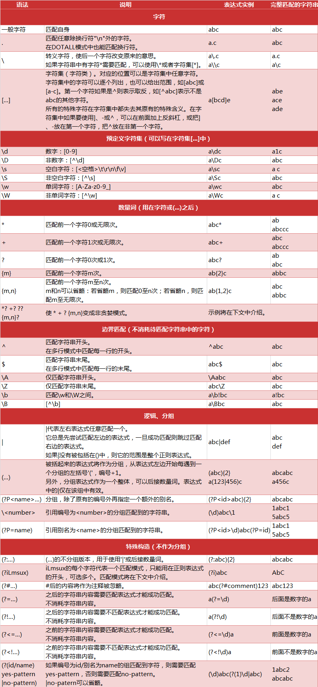

 笔记 

========================================

###桌面快捷方式
\${HOME}local/share/applications为快捷方式配置目录,进入${HOME}local/share/applications目录，创建相关应用desktop文件，如eclipse.desktop．
~~~shell
[Desktop Entry]
Name=Eclipse
Type=Application
Exec=${HOME}/eclipse/jee-neon2/eclipse/eclipse ://${HOME} 用户工作目录
Terminal=false
Icon=/home/redbird/eclipse/jee-neon2/eclipse/icon.xpm
Comment=Integrated Development Environment
NoDisplay=false
Categories=Development;IDE;
Name[en]=Eclipse
~~~~

###Eclipse导入maven的项目
Eclipse 菜单FILE -> Import -> Maven -> Existing Maven Projects
###Ping出现DUP!
ping应答出现了重复的包duplicate
###Ubuntu WiFi热点
修改配置文件
~~~
/etc/NetworkManager/system-connections/
mode=ap(mode改为ap)
~~~
###正则表达式

####贪婪与非贪婪
贪婪匹配:趋向于最大长度匹配.
非贪婪匹配：匹配到结果就好，就少的匹配字符。

####分组(捕获组capture group)
捕获组就是把正则表达式中子表达式匹配的内容，保存到内存中以数字编号或显式命名的组里，方便后面引用。
####无名分组
分组就是用一对圆括号“()”括起来的正则表达式，匹配出的内容就表示一个分组。从正则表达式的左边开始看，看到的第一个左括号“(”表示第一个分组，第二个表示第二个分组，依次类推，需要注意的是，有一个隐含的全局分组（就是0），就是整个正则表达式。 
分完组以后，要想获得某个分组的内容，直接使用group(num)和groups()函数去直接提取就行。
####命名分组
命名分组就是给具有默认分组编号的组另外再给一个别名。命名分组的语法格式如下：
~~~
(?P<name>正则表达式)#name是一个合法的标识符
~~~
####非捕捉组
(?:)参与匹配却不进行分组编号．
(?=)
(?<=)

####正则表达式在线工具

* [可视化显示](https://regexper.com)

* [在线测试](https://regexr.com)

* JAVA正则匹配
JAVA使用Pattern，Matcher
~~~java
import java.util.regex.Pattern;
import java.util.regex.Matcher;
~~~
如字符串
~~~shell
Node    0, zone    DMA32, type      Movable   1862   1665   1697    885    344     99     42     15      4      3      2
~~~
~~~java
regex = "^Node\\s+(\\d+),.*. type\\s+(\\w+)\\s+([\s\d]+?)\s*$";
~~~

###EXT4加密属性
强制加密forceencrypt=footer，无法修改或删除文件
encryptable=footer
###信号
* SIGSEGV
内存错误，数值越接

###CPU占用率
/proc/stat

user nice system idle iowait  irq  softirq steal guest guest_nice

### SHELL bash
控制语句while
~~~bash
#!/bin/bash
a=0
while [ $a -lt 10 ]
do
   echo $a
   a=`expr $a + 1`
   uuid=$(blkid /dev/sdb$a)
   echo ${uuid}
done
~~~
###数据库
####postgresl
切换到数据库
~~~shell
$ su - postgres 
$ psql
$ \l "列出数据库"
$ DROP DATABASE数据库名; //删除数据库
$ \q
$ pg_dump reviewdb > reviewdb_20161222 "备份数据库"
$ psql dbname < backup_file "恢复数据库"
~~~
###JAVA SSL
在ubuntu14.04运行jenkins发现错误　
~~~java
java.security.InvalidAlgorithmParameterException: the trustAnchors parameter must be
    non-empty
~~~
解决方法
~~~shell
$ update-ca-certificates -f 
$ /var/lib/dpkg/info/ca-certificates-java.postinst configure 
~~~
### Jenkins
系统配置，安装插件
* Email Extension Template Plugin
* FTP publisher plugin
* Gerrit Trigger
* Publish Over FTP
* Publish Over SSH

版本自动构建过程

