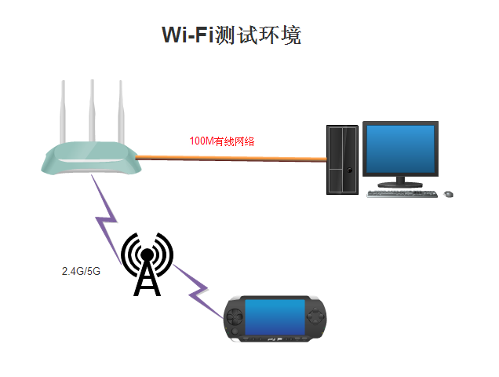
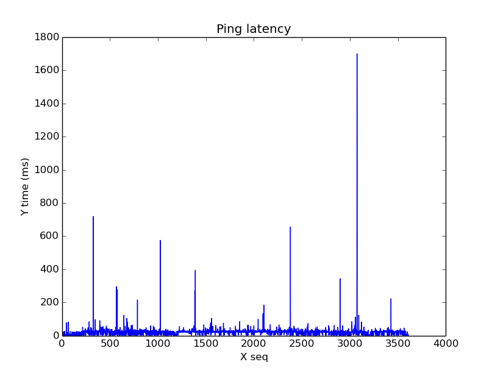
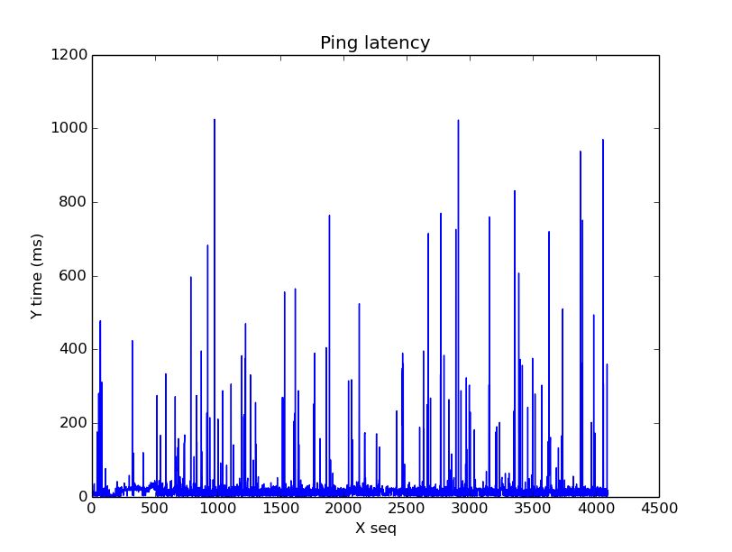

 Wi-Fi Issue Debug

===========================================
###问题描述
Ｗi-Fi网络连接，延迟大，如王者荣耀游戏，延迟经常达到150ms以上．
###测试环境

Linux服务器一台，支持2.4G/5Ｇ的路由器，一台Ｗi-Fi设备．服务器与无线路由器通过有线网络连接(100M)
####网络延迟
Wi-Fi设备与路由器距离0.5m以内，连接网络测试方法Wi-Fi设备ping本地有线服务器．信道1~13信号强度dBm -25dBm~ -32dBm,最小延迟 <10ms, 最大延长 > 1000ms,ping延迟较大概率出现100ms以上.
开发工具ping.py统计网络延迟状态，２台机子同时运行ping记录延迟．

高通手机ping延迟记录（2.4G)

I7 ping延迟记录（2.4G)

分析对比I7延迟出现的概率比较高，本地无线网络延迟在100ms以上，王者荣耀游戏体验变差．
####频段带宽
频段带宽20MHZ/40MHZ,频带更宽容易与别人干扰。WiFi频段带宽越窄，与干扰源频率重合的可能性就越小．
####工具代码
~~~python
import matplotlib.pyplot as plt;
import re;
import numpy as np;
import sys, getopt;

def ping_show(pinglog):
	time_str=[]
	pattern = re.compile(".*time=(.+?) ms.*")
	f = open(pinglog, 'r')
	for line in f:
		time_str+=pattern.findall(line)
	time_np= (np.array(time_str)).astype(np.float)
	x=range(0,time_np.size)
	y=time_np
	plt.title('Ping latency')
	plt.ylabel('Y time (ms)')
	plt.xlabel('X seq')
	plt.plot(x,time_np)
	plt.show()

def main(argv):
	ping_show(argv[0])

if __name__ == '__main__':
	main(sys.argv[1:])

~~~